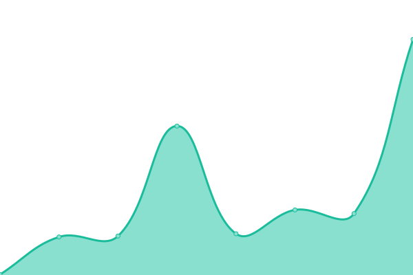

# [📈 Live Status](https://status.hk256.top): <!--live status--> **🟩 All systems operational**

This repository contains the open-source uptime monitor and status page for [白隐 Hakuin](https://www.HK256.top), powered by [Upptime](https://github.com/upptime/upptime).

With [Upptime](https://upptime.js.org), you can get your own unlimited and free uptime monitor and status page, powered entirely by a GitHub repository. We use [Issues](https://github.com/Hakuin123/Upptime/issues) as incident reports, [Actions](https://github.com/Hakuin123/Upptime/actions) as uptime monitors, and [Pages](https://status.hk256.top) for the status page.

<!--start: status pages-->
<!-- This summary is generated by Upptime (https://github.com/upptime/upptime) -->
<!-- Do not edit this manually, your changes will be overwritten -->
<!-- prettier-ignore -->
| URL | Status | History | Response Time | Uptime |
| --- | ------ | ------- | ------------- | ------ |
|  [PB-Website](https://www.hk256.top) | 🟩 Up | [pb-website.yml](https://github.com/Hakuin123/Upptime/commits/HEAD/history/pb-website.yml) | 

 624ms
     
 | 

<a href="https://status.hk256.top/history/pb-website">100.00%</a>
    

|  阿莱（Astrbot 服务） | 🟩 Up | [astrbot.yml](https://github.com/Hakuin123/Upptime/commits/HEAD/history/astrbot.yml) | 

 534ms
     
 | 

<a href="https://status.hk256.top/history/astrbot">100.00%</a>
    

|  CloudArctic 北冰云 后端 | 🟩 Up | [cloud-arctic.yml](https://github.com/Hakuin123/Upptime/commits/HEAD/history/cloud-arctic.yml) | 

 1672ms
     
 | 

<a href="https://status.hk256.top/history/cloud-arctic">99.89%</a>
    

|  [Twikoo](https://twikoo.hk256.top) | 🟩 Up | [twikoo.yml](https://github.com/Hakuin123/Upptime/commits/HEAD/history/twikoo.yml) | 

 1486ms
     
 | 

<a href="https://status.hk256.top/history/twikoo">100.00%</a>
    

<!--end: status pages-->

[**Visit our status website →**](https://status.hk256.top)

## 📄 License

- Powered by: [Upptime](https://github.com/upptime/upptime)
- Code: [MIT](./LICENSE) © [Anand Chowdhary](https://anandchowdhary.com), supported by [Pabio](https://pabio.com)
- Data in the `./history` directory: [Open Database License](https://opendatacommons.org/licenses/odbl/1-0/)
